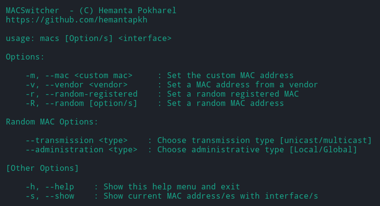

<p align="center">

</a>
<a href="https://github.com/hemantapkh/macswitcher/blob/master/LICENSE" target="blank">

</a>
<a href="https://github.com/hemantapkh/macswitcher/graphs/contributors" target="blank">

</a>
<a href="https://github.com/hemantapkh/macswitcher/fork" target="blank">

</a>
<a href="https://github.com/hemantapkh/macswitcher/stargazers" target="blank">

</a>
<a href="https://github.com/hemantapkh/macswitcher/issues" target="blank">

</a>
<a href="https://github.com/hemantapkh/macswitcher/pulls" target="blank">

</a>
<a href="https://www.youtube.com/c/H9TechYouTube?sub_confirmation=1" target="blank">

</a>
<p align="center">
 
<h2 align="center">MACSwitcher - Easy way to spoof MAC address</h2>

</p>


## ℹ️ MACSwitcher
 
MACSwitcher [(macs)](https://github.com/hemantapkh/macswitcher) is a tool to manipulate the [MAC](https://en.wikipedia.org/wiki/MAC_address) addresses of network interfaces. Sometimes we need to change our MAC address to a specific vendor, which is a boring and time-consuming task. MACS was created so that you can simply change the MAC address to the desired vendor just by typing the vendor name. It contains the [OUI](https://en.wikipedia.org/wiki/Organizationally_unique_identifier) of more than 12500 vendors.


 ##  ⚠️ Requirements

- Python3
- [Ifconfig](https://en.wikipedia.org/wiki/Ifconfig)


## 🛠️ Installation

* Simply execute the following command

```bash
git clone https://github.com/hemantapkh/macswitcher && cd macswitcher && sudo bash install.sh --install
```

*To uninstall macs, execute the command `macs --uninstall`*


### ⁉️ Usage

```Usage: macs [Option/s] <interface>```

### ➡️ Arguments
  
  - **Main Options**

    ```
    -m, --mac <custom mac>     : Set the custom MAC address
    -v, --vendor <vendor>      : Set a MAC address from a vendor
    -r, --random-registered    : Set a random registered MAC
    -R, --random [option/s]    : Set a random MAC address
    ```

    *You are only supposed to pass one argument from the main options.*
      
  - **Random MAC Options**

    ```
    --transmission <type>    : Choose transmission type [unicast/multicast]
    --administration <type>  : Choose administrative type [Local/Global]
    ```

    *You are supposed to pass these arguments only if `-R` or `--random` is passed from the main options.*

  - **Other Options**

    ```
    -h, --help    : Show this help menu and exit
    -s, --show    : Show current MAC address/es with interface/s
    ```


## 🎯 Examples

- **To set a custom MAC address**
    > macs -m XX:XX:XX:XX:XX:XX:XX:XX wlan0

    > macs --mac XXXX wlan0

- **To set a MAC address from certain vendors**
    > macs -v samsung wlan0
    
    > macs --vendor cisco wlan0

- **To set a random registered MAC address**
    > macs -r  wlan0

- **To set a fully random MAC address**
   > macs --random wlan0 
   
   > macs -R --transmission unicast --administration global wlan0 

    > macs -R --transmission multicastcast wlan0

- **To see the current list of interfaces with their MAC**
    > macs -s


## 💚 Contributing

Any contributions you make are **greatly appreciated**.

1. Fork the Project
2. Create your Feature Branch (`git checkout -b feature/AmazingFeature`)
3. Commit your Changes (`git commit -m 'Add some AmazingFeature'`)
4. Push to the Branch (`git push origin feature/AmazingFeature`)
5. Open a Pull Request

*You can also contribute to this project by creating an issue of bugs and feature requests.*


## 🔑 License

Distributed under the MIT License. See [LICENSE](LICENSE) for more information.

-----
Project Maintainer: [Hemanta Pokharel](https://github.com/hemantapkh/) [[✉️](mailto:hemantapkh@gmail.com) [💬](https://t.me/hemantapkh) [📺](https://youtube.com/h9techyoutube)]
